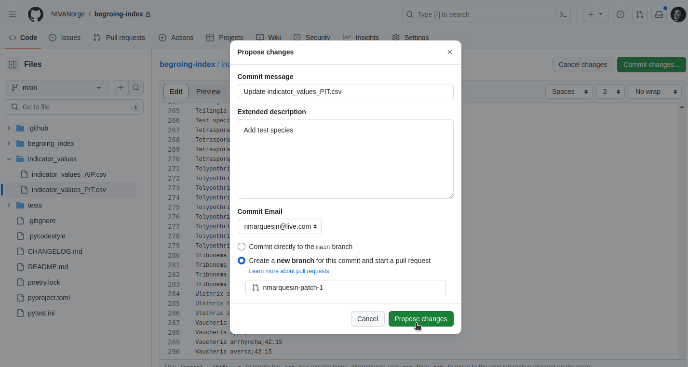

# Index calculation

This library provides functions for calculating data products that contribute towards reaching the goals of EU's water directive.

## Data products

Currently, the following index calculations are supported:

- PIT (periphyton index of trophic status)
- AIP (acidification index periphyton)

## TODO

- HBI2
- functions to calculate nEQR normalization

## Release process

1. do appropriate changes, either locally or on a branch
2. commit changes on main
3. bump the version number in [pyproject.toml](./pyproject.toml#L3)
4. push to main branch. This triggers deploy job in (github actions)[https://github.com/NIVANorge/begroing-index/actions]
5. new version should appear at https://pypi.org/project/begroing-index/

## For researchers: How to add genus/species and values

**STEP 1:** In the github repository front-page, click on **indicator_values** folder

**STEP 2:** Select the file to edit, between `indicator_values_AIP.csv` and `indicator_values_PIT.csv`

**STEP 3:** Click on the pencil icon to edit the file

**STEP 4:** Add the desired genus/species with its value, separated by a semicolon `;`. See line 266 in the example below. Then click on **Commit changes...**

**STEP 5:** This will redirect to a **pull request form**. Add a description and select a reviewer. The reviewer should be someone who can approve your pull request, if in doubt, email <miljoinformatikk@niva.no> to ask or select one of the people listed under contributors on the right column of the repository's front-page.

**STEP 6:** Click on **Create pull request**.

**STEP 7:** Select **Create a new branch for this commit and start a pull request**.

**STEP 8:** Click on **Propose changes**.

**STEP 9:** The reviewer will be notified of your request and will approve it or suggest modifications. You will be notified of any activities by email.

